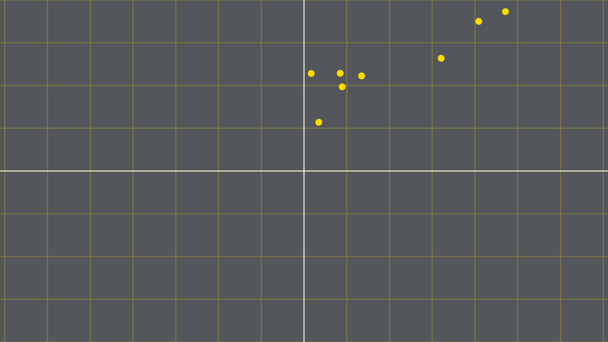

```{r, include=FALSE}
library(knitr)
library(xaringanthemer)
library(patchwork)
library(extrafont)
library(scales)
library(fontawesome)
library(mgcv)
library(transformr)
library(tidyverse)
library(kableExtra)
set.seed(20211203L)
```

```{r theme, include=FALSE}

PROMU_YELLOW = "#FDDB00"
#PROMU_GREY = "#adafb2"
PROMU_GREY = "#53565A"

options(htmltools.dir.version = FALSE)
opts_chunk$set(
  fig.path = "media/",
  fig.width = 15,
  fig.height = 100/15,
  fig.retina = 3,
  out.width = "100%",
  cache = FALSE,
  echo = FALSE,
  message = FALSE, 
  warning = FALSE,
  fig.showtext = FALSE,
  fig.align = "center",
  hiline = TRUE,
  dev.args = list(bg = "transparent")
)
style_duo(
  primary_color = PROMU_GREY,
  secondary_color = PROMU_YELLOW,
  title_slide_background_image = "media/logo.svg",
  title_slide_background_size = "320px",
  title_slide_background_position = "10% 90%",
  text_font_google = google_font("Roboto"),
  header_font_google = google_font("Roboto Condensed")
)

theme_set(
    theme(
      text = element_text(
        color = theme_xaringan_get_value("text_color")
      ),
      title = element_text(
        family = gsub("'", '', theme_xaringan_get_value("header_font_family")),
        color = theme_xaringan_get_value("header_color")
      ),
      line = element_line(
        color = lighten_color(theme_xaringan_get_value("background_color"), 0.1)
      ),
      plot.background = element_rect(
        color = theme_xaringan_get_value("background_color"),
        fill = theme_xaringan_get_value("background_color")
      ),
      plot.margin = margin(10, 10, 10, 10),
      plot.title = element_text(
        size = rel(1.5),
        hjust = 0.5,
        margin = margin(0, 0, 20, 0)
      ),
      strip.text = element_text(
        family = gsub("'", '', theme_xaringan_get_value("header_font_family")),
        color = theme_xaringan_get_value("header_color")
      ),
      axis.text = element_text(
        size = rel(1.5)
      ),
      axis.title = element_text(
        size = rel(2)
      ),
      legend.text = element_text(
        size = rel(1.5)
      ),
      panel.grid = NULL,
      legend.position = "bottom",
      legend.key = element_rect(fill = PROMU_GREY, color = PROMU_GREY),
      legend.background = element_rect(fill = PROMU_GREY, color = PROMU_GREY),
      panel.background = element_rect(fill = PROMU_GREY),
      panel.grid.major = element_line(colour = lighten_color(PROMU_GREY, 0.2)),
      axis.line = element_line(colour = lighten_color(PROMU_GREY, 0.2)),
      strip.background = element_rect(fill=PROMU_GREY)
    )
)

update_geom_defaults("text", list(
  family = theme_get()$text$family
))
update_geom_defaults("label", list(
  family = theme_get()$text$family
))
update_geom_defaults("col", list(
  fill = theme_xaringan_get_value("text_bold_color")
))
update_geom_defaults("point", list(
  color = PROMU_YELLOW,
  fill = PROMU_YELLOW,
  shape = 21,
  size = 3
))
update_geom_defaults("line", list(
  color = theme_xaringan_get_value("text_color")
))
```

```{r load_data, include = F}
dat_pca <- read.csv("./data/pca_example.csv") %>% 
  mutate(across(.fns = ~round(.x, 3)))

source("./src/PCA_geo_assets.R", encoding = "utf-8")
```


# Classification de la méthode

--

* Méthode non supervisée

  * Utilise la structure des données et non une variable réponse
  * $\{x_1,x_2,...,x_n\}\rightarrow\{PC_1,PC_2,...,PC_n\}$

--

* Réduction de la dimensionnalité

  * $\{x_1,x_2,...,x_n\}\rightarrow\{PC_1,PC_2\}$

--

* Pourquoi?

  * Visualisation
  * Modélisation
  * Comprendre les corrélations entre les données

???

Visualisation: On ne peut pas faire un graphique à 10 variables, mais si on peut réduire nos 10 variables en 2 principal components qui résument leur effets, c'est plus gérable pour visualiser la donné

Modélisation: 2000 variables, mais 1000 observations, peut nécessiter de réduire le nombre de variables pour fitter un modèle


---

# Fonctionnement de la méthode

Le jeu de données:

.left-column[
```{r}
dat_pca %>% 
  mutate(obs = 1:n()) %>% 
  select(obs, a, b) %>% 
  kbl(align=c("l", rep('c', 3)))
```
]

.right-column[

```{r, out.width = "700px"}

```

]

???

On va maintenant regarder les différentes étapes nécessaire pour créer les principal components à partir de ces deux variables

---

class: center middle
# 1. Centrer et réduire les variables

???
Avant de commencer à appliquer la méthode, on va faire 2 transformations au data, 
pour des raisons que je vais aborder plus tard

---

<video width="100%" height="100%" id="bg_vid">
    <source src="media/videos/pca_viz/2160p60/center_points.mp4">
</video>

???
La première transformation est de centrer les variables, donc les ajuster pour qu'elles aient toutes une moyenne de 0

---

<video width="100%" height="100%" id="bg_vid">
    <source src="media/videos/pca_viz/2160p60/scale_points.mp4">
</video>

???

La deuxième est de réduire les variables, donc on les modifient pour qu'elles aient un écart type de 1

---

# Résultat

```{r}
bind_rows(
  dat_pca %>% 
  select(a, b, a_scaled, b_scaled),
  dat_pca %>% 
  select(a, b, a_scaled, b_scaled) %>% 
    summarise(across(.fns = mean)),
    dat_pca %>% 
  select(a, b, a_scaled, b_scaled) %>% 
    summarise(across(.fns = sd))
) %>% 
  mutate(
    across(.fns = ~round(.x, 3)),
    row_name = c(rep("", 8), "Moyenne", "Écart type")
    ) %>% 
  select(5, 1:4) %>% 
  kable(
    align=c("l", rep('c', 4)),
    col.names = c("", "a", "b", "a'", "b'")) %>% 
  kable_styling() %>% 
  row_spec(8, underline = T) %>% 
  row_spec(9:10, bold = T) %>% 
  column_spec(c(2, 4), border_left = T)
  
  

```

---

class: center middle
# 2. Trouver les « principal components »

---

# Idée générale

<video width="100%" height="100%" id="bg_vid">
    <source src="media/videos/pca_viz/2160p60/pca_idee_gen.mp4">
</video>


<!-- 


  Comme j'ai mentionné précédemment, la PCA est une méthode de réduction de la dimensionnalité, donc on cherche à éliminer des variables pour en garder seulement quelques unes significative, tout en gardant l'information importante des variables initialles.
    
    
    
  Pour arriver à cela, on va trouver un nouveau système d'axes où on va chercher à maximiser l'information contenu dans chaque axe
    De cette façon, les derniers axes auront moins d'information et pourront potentiellement être ignorés
    
  Cette information va être mesurée par la distance au carré de chaque point sur l'axe
    On utilise la distance au carré pour ne pas qu'une distance négative en annule une positive
  
    C'est aussi pour cette raison qu'il est très important de centrer et réduire notre data
      Si on a une variable qui est de 0 à 1 et une autre de 0 à 10000, le fait de prendre la distance au carré sans 
      centrer et réduire ferait que la plus grosse variable aurait une beaucoup trop grosse influence sur le principal component     

    Donc ici pour notre axe des X de départ, on peut voir que le point le plus loins est à 2.4... SWITCH
-->


---

background-image: url("media/images/pca_viz/distance_vis0_ManimCE_v0.15.1.png")
background-position: center
background-size: contain

<!---
<video width="100%" height="100%" id="bg_vid">
    <source src="media/videos/pca_viz/2160p60/pca_init.mp4">
</video>
--->

---

<video width="100%" height="100%" id="bg_vid">
    <source src="media/videos/pca_viz/2160p60/project_points.mp4">
</video>

---

<video width="100%" height="100%" id="bg_vid">
    <source src="media/videos/pca_viz/2160p60/distance_vis1.mp4">
</video>

---

<video width="100%" height="100%" id="bg_vid">
    <source src="media/videos/pca_viz/2160p60/distance_vis2.mp4">
</video>

---


<video width="100%" height="100%" id="bg_vid">
    <source src="media/videos/pca_viz/2160p60/tot_distance_calc.mp4">
</video>

---

<video width="100%" height="100%" id="bg_vid">
    <source src="media/videos/pca_viz/2160p60/pc1_find.mp4">
</video>

---

<video width="100%" height="100%" id="bg_vid">
    <source src="media/videos/pca_viz/2160p60/pc1_set.mp4">
</video>

???

Maintenant qu'on a le premier PC, on s'attaque au 2e

Dans ce cas à 2 dimensions, la solution est triviale parce que les principal components doivent toujours être perpendiculaires les uns les autres, donc seulement un possible

---

<video width="100%" height="100%" id="bg_vid">
    <source src="media/videos/pca_viz/2160p60/pc2_find.mp4">
</video>

---

<video width="100%" height="100%" id="bg_vid">
    <source src="media/videos/pca_viz/2160p60/rotate_axes.mp4">
</video>

---

<video width="100%" height="100%" id="bg_vid">
    <source src="media/videos/pca_viz/2160p60/calc_ssd_pc.mp4">
</video>

---

<video width="100%" height="100%" id="bg_vid">
    <source src="media/videos/pca_viz/2160p60/reduce_dim.mp4">
</video>

---

class: center middle
# Un exemple pratique

---

# Le jeu de données

```{r}
plt_geodat_boxplot
```

---

# Résultat de l'application


```{r}
plt_pct_var
```

---

# Résultat de l'application

```{r}
plt_pc_scores
```

---

# Visualisation des résultats
```{r}
pc_points
```

---


# Visualisation des résultats

```{r}
dens_scores
```

---


# Visualisation des résultats - Montréal

```{r}
mtl_scores
```


---

# Visualisation des résultats - Québec

```{r}
qc_scores
```

---

class: center middle
# Questions?


